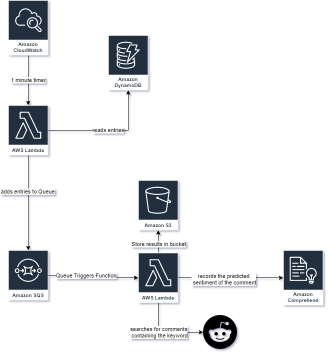

# aws-lambda-comprehend

- use sam to build, test, and deploy the lambda functions
- ensure lambda functions have proper roles and permission.
- setup dynamodb and sqs independently

## The Pipeline

## references
- https://github.com/noahgift/awslambda
